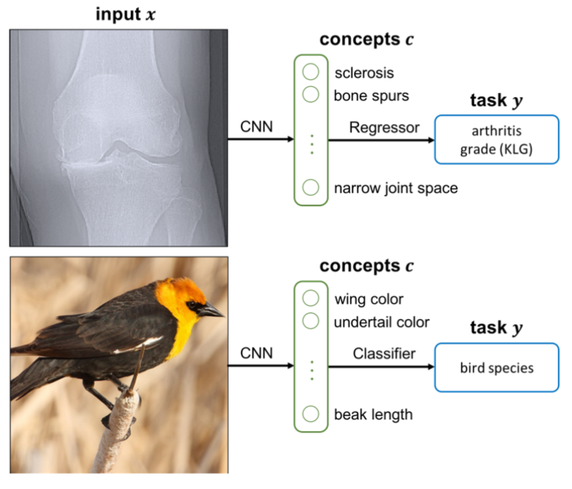

---
title: Concept Bottleneck Model
summary: Use Concept Bottleneck to interprete NN's decisions.
date: 2023-10-25
authors:
  - admin
tags:
  - Concept Bottleneck
image:
  caption: 'Image credit: [**Unsplash**](featured.png)'

---

## Construct A concept bottleneck model

将一个黑盒模型加上一个中间概念层，使得模型将输入特征映射到中间概念层中，再由概念层映射到目标分类层。    
这样可以展现每个输入数据对于中间概念的得分，表现出模型是否学习到正确的属及其程度，增强模型的可解释性。    
如此CBM的关键就是概念层的构建。本文的两个数据集OAI和CUB200都是由人工标注的概念属性

## Application

### dataset with human annotation

实验用到的数据集OAI和CUB200都是经过这方面的专家利用他们自己的推理方式得到的高级概念进行注释的。   
实验结果表明在OAI数据集上，CBM具有和黑盒模型不相上下的性能；而在CUB200数据集上，CBM略弱于黑盒模型。    

### Concept intervention

我们借助概念层得以窥见CBM对于输入数据预测结果的判断依据，理解模型的行为。通过调整模型概念层的分数，可以改变模型的预测结果，纠正模型的错误预测。
