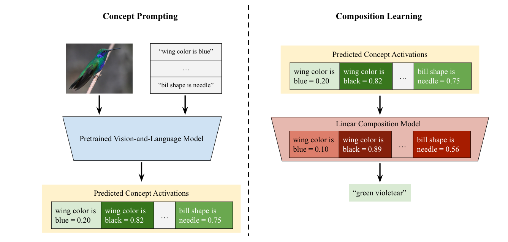
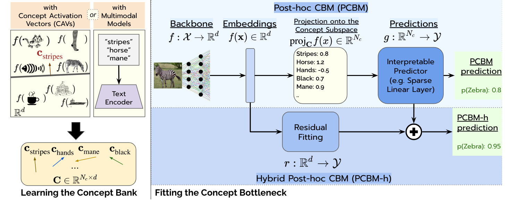
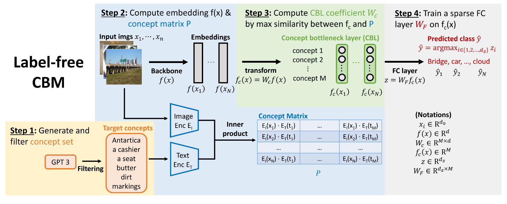
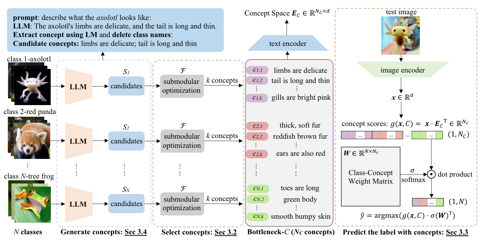
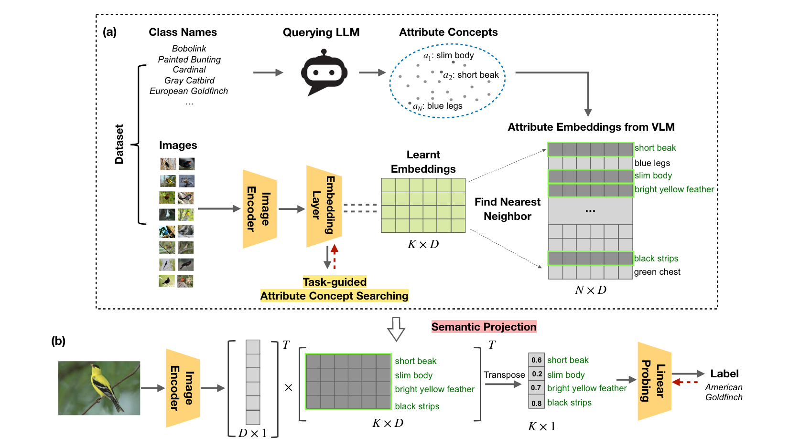
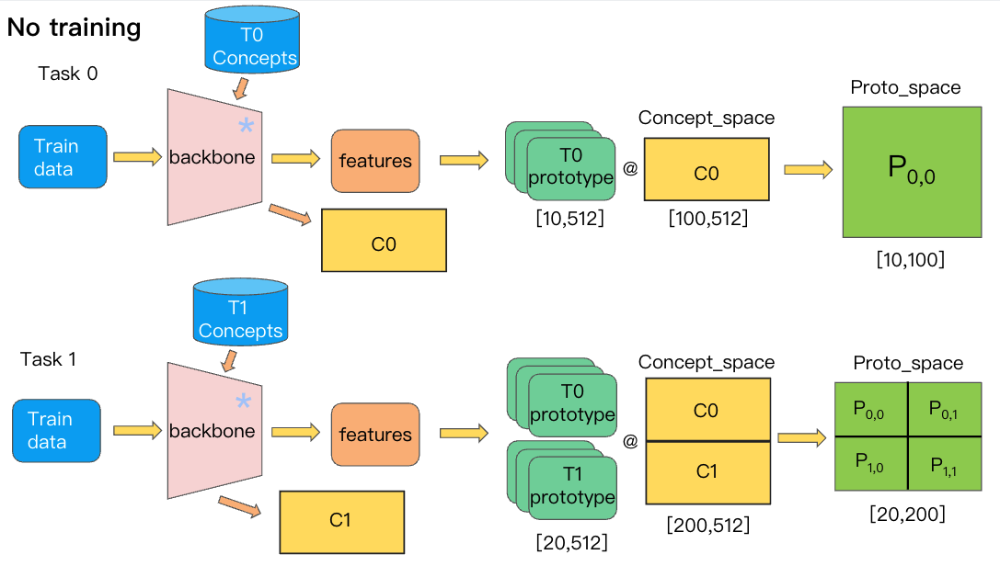
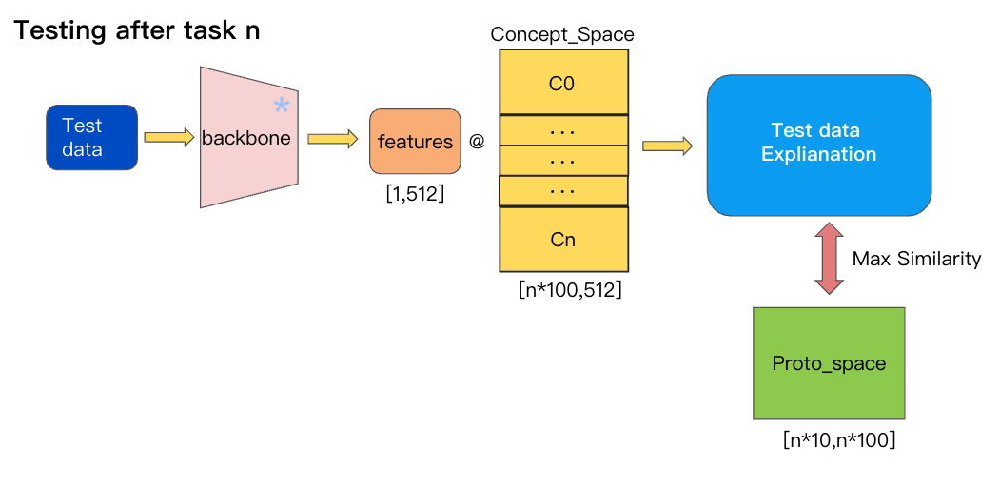
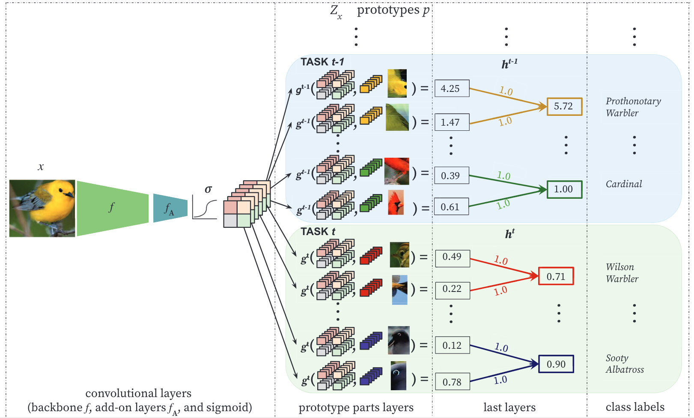

# Continual-CBM
Prototype-based concept bottleneck model, under exemplar-free and CIL setting   
Continual-CBM mitigate “catastrophic forgetting” problem, and bring interpretability into Continual Learning

## What's the difference between this and traditional CBM?
### Traditional CBM
    Concept Bottleneck Models (CBM) are inherently interpretable models that factor model decisions into humanreadable concepts. They allow people to easily understand why a model is failing, a critical feature for high-stakes applications.     
最初的CBM模型中概念是需要人工修改的，而且对于不同的数据集需要不同的专业人员来制定，其应用成本相对来说较高。得益于大模型的发展，现在的大模型已经具备了诸多方面的知识，这使得获取概念的成本大大降低。CBM是利用文本概念对图像进行解释，而多模态大模型具备跨模态对齐能力，所以利用多模态模型（如CLIP）来计算CBM中图像与概念的匹配分数非常合适。compMap首先提出利用CLIP模型来计算图像与概念集合的匹配分数，进而训练线性层来将这些分数映射到类别维度。后来，LaBo、LM4CV等方法在compMap的基础上进行改进。它们使用GPT3等大语言模型获得相应类别的特征描述，训练子模块筛选从GPT获得的概念，得到筛选概念集，并以此训练CBM。
 - **compMap**    
   train backbone, need labeld concept  
   first CBM based on CLIP
   
 - **PCBM**    
   train backbone, need labeled concept   
   Integrate interpretable prediction with visual prediction by residual link
   
 - **Label-free CBM**    
   train backbone,but no need labeled concept   
   CBM without concept label
   
 - **LaBo**     
   no training on backbone, no need to label concept    
   Based on CLIP   
   Add concept selection submodular to CBM based on CLIP
   
 - **LM4CV**     
   no training on backbone, no need to label concept    
   Based on CLIP   
   Improve select algorithm, less concept get same performance of LaBo 
        
Due to CLIP's ability of cross-modal, it's easy to get the concept score of an image. We implement a CBM based on CLIP like *LaBo* and *LM4CV*.    
### What modifications of Continual-CBM were conducted based on Traditional-CBM to adapt to Continual Learning setting ?
We are first proposed to Concstruct CLIP-based CBM in Continual Learning setting. The Image-Text pair ability of CLIP makes CBM no need annotation of concept, explaining in a label-free fashion.     
**Continual-CBM in Class-Incremental Learning procedure:** 

- In every task , We will get the corresponding image data, class order and concepts of classes of current task. 
- In current task, we run the concept selection algorithm, get *m* concepts for  current task, and then get the concepts through *text encoder* of CLIP to get the concepts embeddings, generating *concept bottleneck* of current task. 
- After generate *bottleneck*, we build up *prototypes* of each class. Each prototype represents its class data. We assumption that image sample of same class has similar concept score distribution, and image sample has similar concept score distribution to its class prototype. Based on this, we construct *Proto Space* as our classifier, which consist of concept score distribution of prototypes. 
- Once we have successfully constrcut the components of our model, then we can proceed evaluation. For each eval image, we first calculate the CLIP score distribution with *bottleneck*, and then calculate the similarity between its score distribution with *Proto Space*, then get the classificaton results. 
- During the incremental stage, we repeate 2-4 step mentioned above, and save bottleneck of each task. So the old class prototype will calculate new task score distribution, and new class prototype will also calculate old task core distribution, the score distribution will contain all learned concepts.  
 
**Continual-CBM components:**  
1. Classifier
   1. Singel-head
      Using singel-head classifier will bring problems. *Concept Bottleneck* that we saved as much as tasks learned, which made it difficult to classification. As far as we know, *Concept Bottleneck* project the score distribution space to classification space, the dimension of singel-head classifier will increase both input and output, making it less interpretable to the model.      
      > Continual-CBM implemented in this way need to fix the size of Concept Bottlenck and come up with an algorithm to control the ratio of concepts from different tasks in *Concept Bottleneck* incrementally, which is tough and decreases interpretable.
   
   2. Multi-heads
      Building classifier in multi-heads fashion doesn't have such worries that occurred in singel-head. In this manner, we store each *Concept Bottlenck*, and train a linear classifier for each task to proj scores to classes. During evaluation, we calculate scores between image features and every *Concept Bottlenck*, and concate the results that projected by all heads as the final prediction.
      > Continual-CBM implemented in this way need to store all *Concept Bottlenck* data and classification heads, we also have conducted some exps in this manner, but it doesn't preform well.

   3. Prototypical
   
      Due to the special features of Class-incremental Learning and CBM, we argue to store all *Concept Bottleneck*. According to analysis above, we have to tackle the dimension problem, we proposed to classify images using prototypical classifier inspired by *Prototypical Network*. To construct this classifier, first, calculating the score distribution of each prototypes, and then stack them up as *Proto Space*, whose shape is (*proto_num* , *concept_num*). Each row of *Proto Space* represents the prototype's score to all given consepts. Comparing to original CBM that interpretates decisions of model by a sparse linear layer to project concept scores to classification results, our prototypical classifier classifying image by calculating the similarity or "distance" between image's score distribution and *Proto Space* which is much more interpretable than single linear layer, because the prototypical network is born with a bit interpretability.
      > Continual-CBM implemented in this way need to store all *Concept Bottleneck* data and prototypes. We also found that the more prototypes were built, the more higher model accuracy we got.     

2. Concept Space
  Concept score space is vital to a CBM. Once the concept score space accuqired, we could train a linear to project score distribution into classes. We follow the method to get concept space that *LaBo* and *LM4CV* utilized. First, we get concepts of all classes by prompting chatGPT, after that, we extract the features of this concepts using *CLIP text encoder* and stack them up as *Concept Space(Concept Bottleneck)*. As tasks have learned, *Concept Space* will expand to corresponding size.     
3. Training cost
  The training cost of original CBM can split to 2 parts: 1. Train a backbone network to map the image features to score distribution 2. Train a sparse linear layer to project score distribution. CLIP-based CBM use clip image encoder as backbone, no need to train backbone network, so the training cost of this kind CBM is a single linear layer only. Our method is a kind of CLIP-based CBM in Class-incremental Learning scenario, so we no need to train backbone, and also no need to train linear layer because of prototypical classifier. In a word, our method is a training-free method.
4. Storage cost
  During each task, we need to calculate a prototype for each class, and generate *Concept Bottleneck*, then calculate score distribution of prototypes to *Concept Bottleneck* called *Proto Space*. We need to store the *Concept Bottleneck* and *Proto Space* for every task.

## What's the difference between ours and ICICLE?
ICICLE, an interpretable approach to class-incremental learning based on prototypical parts methodology.     
Continual learning poses new challenges for interpretability, as the rationale behind model predictions may change over time, leading to interpretability concept drift. While existing CL approaches significantly reduce catastrophic forgetting, they are often difficult for humans to understand
ICICLE takes Prototypical part network as base architecture, which introduces an additional prototypical part layer *g* proceeded by a backbone convolutional network *f* with an add-on $f_A$ and followed by the fully connected layer *h*. The $f_A$ add-on consists of two 1 × 1 convolutional layers and a sigmoid activation at the end, translating the convolutional output to a prototypical part space.      

The prototypical part layer *g* consists of K prototypes $p_i$ ∈ $R^D$ per class, and their assignment is handled by the fully connected layer h.

1. interpretability regularization
2. proximity-based prototype initialization
3. task-recency bias compensation

The training phase of ICICLE includes 3 parts, while our is training-free. ICICLE need to train backbone continuously, so the features extracted by backbone will drift a lot after few tasks have been learned, the prototypes drift too, inducing interpretability concept drift.    
**Interrpetability concept drift**    
In ICICLE, the interpretability concept drift occurs when a similarity map differs between tasks, it can be formally defined like:
$$
ICD =\mathbb{E}_{i, j=1}^{H, W}\left|\operatorname{sim}\left(p^{t-1}, z_{i, j}^{t}\right)-\operatorname{sim}\left(p^{t}, z_{i, j}^{t}\right)\right|
$$   
where $(z_{i,j})^{H,W}_{i,j=1}$ corresponds to input image representation, $p_{t−1}$ and $p^t$ correspond to prototypical part *p* before and after task *t*, and *sim* is similarity.    
We implement *Continual-CBM* using CLIP image and text encoder as backbone, which is freezed, it won't changes along with the tasks learnt. So in this manner, prototypes stored in last task will not drift in next task.
ICICLE conducts exps on CUB dataset, which is fine-grained dataset, the performance of ICICLE on general datasets is unknown. We have conduct amout of exps on both fine-grained and general datasets.