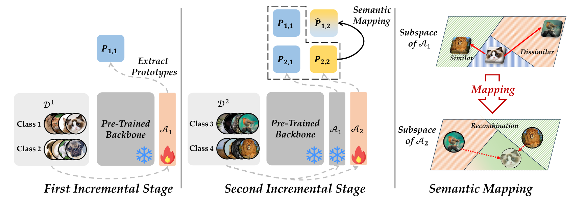
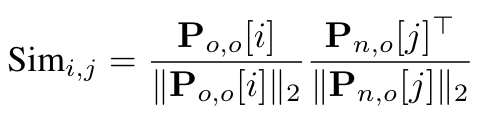
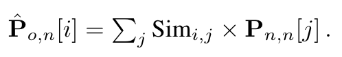
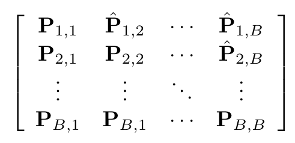
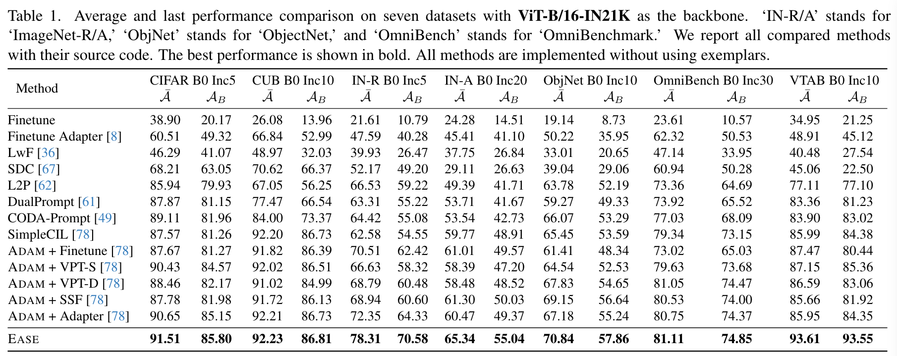

> 原文链接：[EASE](http://arxiv.org/abs/2403.12030)

## Core idea
1. 每个任务训练一个Adapter，使得学习新任务时几乎不会对旧任务的知识产生影响。
2. 利用原型分类器进行分类，可以很好的利用每个Adapter的知识。
3. 利用prototype恢复方法拟合旧任务的数据经过新任务的Adapter所得到的原型。

## Overview

## 原型恢复方法
作者认为不同的类别语义上的相关性可以跨越不同的特征空间，可以基于重用相似类别的原型生成其相关类别的原型。具体来说，作者的方法是测量旧子空间（所有类同时出现）中新旧类之间的相似性，并利用它来重建新嵌入空间中的原型。
- 计算类别之间的相似性：
  
  $P_{i,j}$:i指代第i个任务的数据，j指代第j个Adapter。在这里，n指代新任务，o指代旧任务
  在此基础上继续进行归一化：$Sim_{i,j} = \frac{\text{exp}^{Sim_{i,j}}}{\sum_j\text{exp}^{Sim_{i,j}}}$

在得到相似度矩阵后，我们进一步利用类别相似性矩阵在新的子空间中重建旧的类原型：

在此之后，我们就得到了最终的用于分类的原型分类器：

此外，为了进一步提高模型性能，作者对原型进行加权：对于经过同一Adapter的数据提高权重。
$$P^T_{b,b}\phi(x;\mathcal{A_b})+\alpha\sum_{i\neb}P^T_{b,i}\phi(x;\mathcal{A_i})$$

## Experiments
