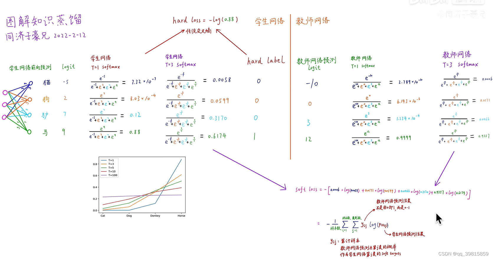
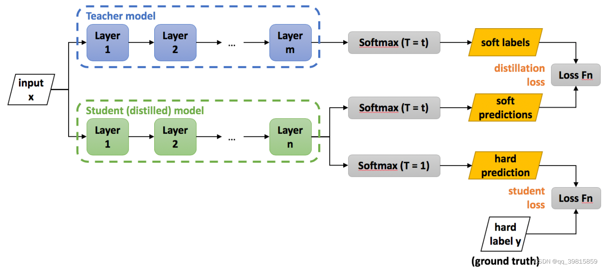

---
title: Knowledge distillation
summary: NIPS2014 
date: 2024-06-10
authors:
  - admin
tags:
  - Knowledge Distillation
  - Model arch
---
> [原文](https://arxiv.org/abs/1503.02531)
> 本篇博客笔记是对B站up主同济子豪兄讲解的知识蒸馏开山之作的重点记录整理。

---
知识蒸馏是从一个网络中提取蒸馏有用的知识到另一个网络中，使得另一个网络具备原网络的能力。能够将大模型压缩成小模型。
在这个过程中可以看作是一对网络：教师——学生网络，教师掌握的知识多，学生需要学习教师的网络。教师将TA的知识传授给学生。
## Soft Target 与 Hard Target
一个分类任务，网络接受一张马的图片，得出一个预测的输出。
- 对于Hard Target 来说，网络会直接输出预测为马的概率为1，而其他类的概率为0。
- 而对于Soft Target 来说，网络会给出一个预测概率分布。比如预测该图片为马的概率是0.7，为驴的概率为0.4，为汽车的概率为0.1等。而不是直接输出0。
由此我们可以看出，采用Soft Target 得到的信息量比用Hard Target 的多。在现实世界中也好理解。因为马与驴还是具有一定的相似性的，比如都有四条腿，有尾巴，脖子都比较长等；汽车中也有“马”，如德国汽车宝马，美国的野马汽车，还有法拉利的标志上也带有马。所以不能说完全没有相似性，采用Soft Target 比用Hard Target 要更好。
> Soft Target 也可以抑制模型训练过拟合。
## 蒸馏温度T
Softmax输出$q_i = \frac{exp(z_i/T)}{\sum_j exp(z_j/T)}$。 
若T= 1，则为Softmax，T可以改变，以此来将Hard Target 变成 Soft Target。
### Simple demonstration

Softloss 来比较教师网络与学生网络输出预测的差异。教师网络预测出第 j 类的概率作为学生网络第 j 类的Soft Target。
## 知识蒸馏的过程

## 实验结果
作者在MNIST手写数据集上进行了实验，预测效果十分出色，学生网络的预测准确率与教师网络相差无几。并且有意外收获。
作者在训练学生网络时，将数字3的数据全部剔除，然后得到学生网络。发现学生网络对于未见过的3也能有很好的预测效果。因为教师网络是已经训练过3这个数字的，在知识蒸馏的过程中，教师将3的有关知识和信息传授给学生网络，使其也可以预测未见过的3。这其实实现了小样本学习甚至零样本的学习。
## 知识蒸馏的应用场景
- 模型压缩
- 优化训练, 防止过拟合(潜在 的正则化)
- 无限大、无监督数据集的数据挖掘
- 少样本、零样本学习
- 迁移学习
