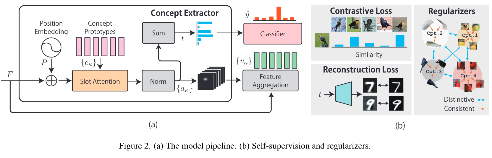
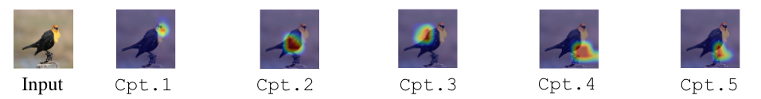

[原文](http://arxiv.org/abs/2304.10131)
## Overview

汲取ProtoPNet的思想，Visual Concepts
初始化一个Concept矩阵C，C的每一列就代表一个concept。然后在模型训练的过程中优化学习矩阵C。   
{$\alpha$}代表Concept矩阵与输入图像特征图的Att图，可以看出concept对应到图像中的哪个部位，每一张图对应一个concept。   

### Concept Extractor
Concept Extractor 产生 concept bottleneck 激活向量 *t*   
- 将slot-Att得到的向量进行归一化：$\alpha_k = \phi(Q(c_k)^TK(F'))$, $\phi$ is the **norm** func   
- 再求和：$t_k = \text{tanh}(\sum_m \alpha_{km})$   

$c_k \in C$, represents a concept of all concepts; $\alpha_k in A$,represents a att map of all slot-Att maps.

### Feature Aggregation

$v_k = Fa_k$,   
将提取到的特征图F与slot-Att得到的注意力图做点积，得到concept feature向量

## Training phases

### Self-supervision concept discovery（no concept found actually）
    B代表当前patch。
    x代表原始图像；   
    D——Decoder，接收概念激活向量t作为输入，重构原始图像。

 - **Reconstruction loss**
    $$l_{rec} = \frac{1}{|B|}\sum_{x \in B}||D(t) - x||^2$$
    使得decode的t与原始图像更接近，提升concept激活的准确度和稳定性。   
 - **Contrastive loss**
    $$l_{ret} = -\frac{1}{|B|}\sum\alpha(y,y')\text{log}J(\hat{t},\hat{t'},y,y')$$   
    $$J(\hat{t},\hat{t'},y,y') = \left\{\begin{matrix} 
            \sigma(\hat{t}^T\hat{t'})& \text{for y = y'} \\  
            1-\sigma(\hat{t}^T\hat{t'})& \text{otherwise}
            \end{matrix}\right. $$ 
    在训练过程中，每一个Batch包含许多张图片，而训练数据集中的图片数量往往大于类别数量。所以对于属于同一类别的不同图片，其concept激活向量应大致相同。   
    例如一对训练图片(x,x')，对应的concept激活向量t，t'；对应图像label y和y'。    
    > $\alpha$ is the weight to mitigate the class imbalance.   

### Concept regularizers
增加约束损失项，负相似度计算，增大类间距离，缩小类内距离.....

