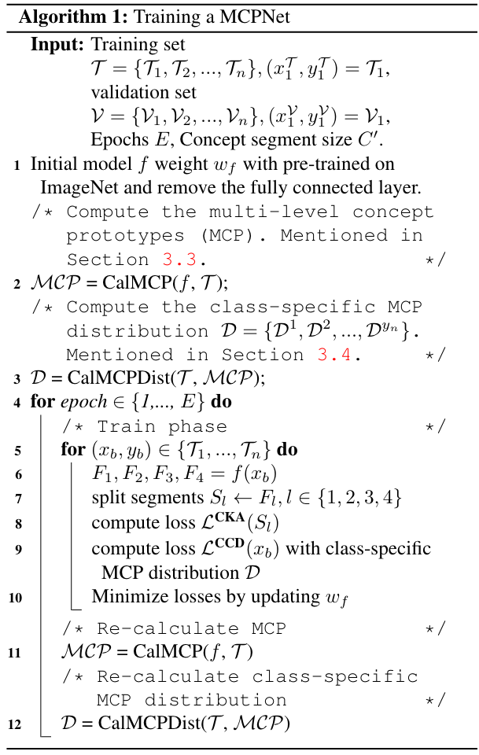
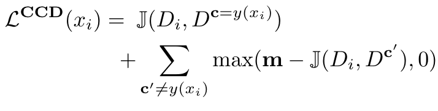

> [原文](http://arxiv.org/abs/2404.08968)

## Core idea

作者认为用通过backbone得到的特征来做原型太单一，遂决定提取通过不同backbone层数后特征做原型，设置“原型强度”指标，来查看不同层数原型的特点，以此作为原型分布，并通过比图像通过backbone得到的多层数原型分布来完成分类任务

## Work flow

在训练阶段，我们计算每个训练图像的MCP分布，最后将其平均，得到每个类的原型分布并保存；在测试阶段，想要分类一张图像，我们首先计算他的**MCP**分布，然后将其MCP分布与所有的原型分布比较(JS散度)完成分类。

## Training flow 

### Algorithm

### CKA Similarity
在训练backbone的同时，提取得到目标类的多层原型，CKA(Centered Kernel Alignment) 旨在使得到的原型更加多样更具辨别性   
     
$H$代表无偏希尔伯特-施密特独立性准则，$H(X,Y):$    
     
CKA loss:   
$$\mathcal{L}^{CKA}(S_l) = \frac{2}{M_l(M_l-1)}\sum^{M_l}_{i=1}\sum^{M_l}_{j=1}\bold{CKA}(S_{l,i},S_{l,j})$$
其中$S_{l,i}$表示第l曾第i个概念切片，$M_l$代表第l曾的概念切片总数。    

### CCD loss
计算样本的多层概念分布，与原型的概念分布进行JS散度计算，使得样本的分布尽量靠近类原型的分布，提高分类精度。m是一个超参数，当样本与其不同的类原型的分布相似时，应加大损失。     

综上所述，该方法的总损失为：     
$$\mathcal{L} = \sum^L_{l=1}\mathcal{L}^{CKA}(S_l) + \lambda_{CCD}\sum_{x_i \in X}\mathcal{L}^{CCD}(x_i)$$

### Test flow
测试时与[Prototypical Network](../prototypical-network/) 相似，也是计算与原型的相似度（距离），完成分类，可解释性更强。

## Experiments

### Main results

### 原型概念切片

此外，基于原型的方法相比于其他方法在小样本领域更加有效。     

