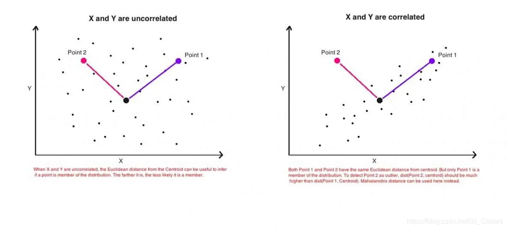
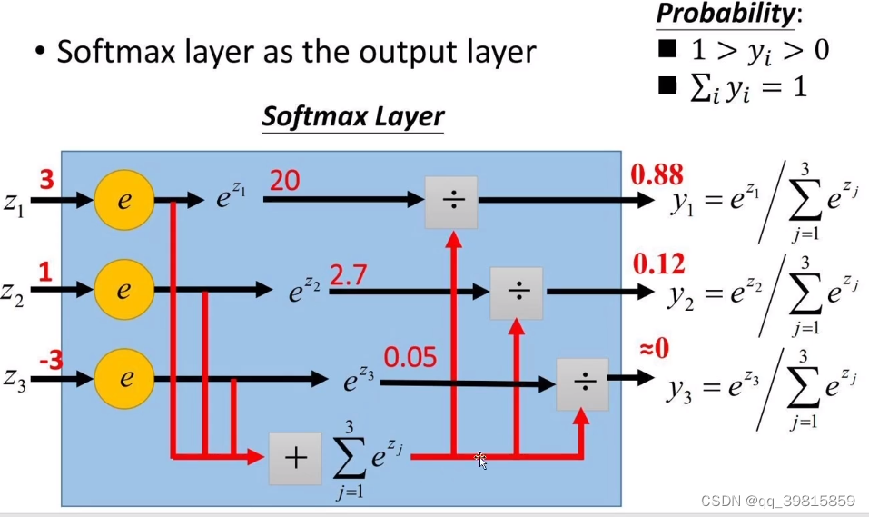
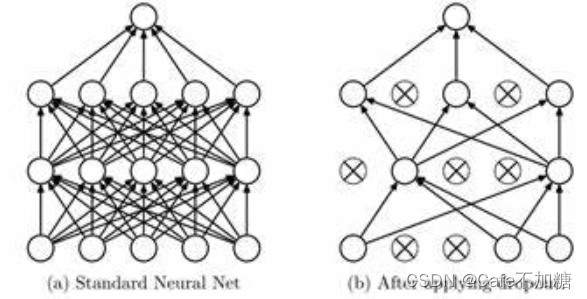
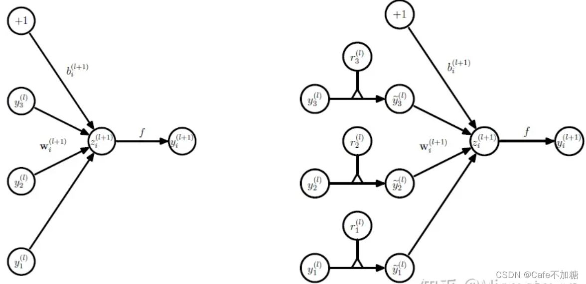
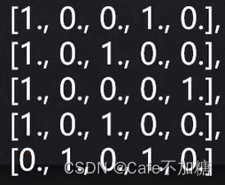

## 信息熵：
$H(x) = \sum_{k=1}^{n}p_klog_2p_k$
## KL散度：
相对熵 = KL散度
KL散度：两个概率分布间的非对称性度量
KL散度就是用来衡量同一个随机变量两个不同分布间的**距离**。
$$
D_{KL}(p||q) = \sum_{i=1}^{n}p(x_i)log(\frac{p(x_i)}{q(x_i)})
$$
由此可见，KL散度必 > 0；
### KL散度的特性
1. 非对称性
	$D_{KL}(p||q) \neq D_{KL}(q||p)$；P和Q的概率分布完全一样才相等。
2. 非负性
	$D_{KL}$恒大于等于0。
### KL散度公式变形
$D_{KL} =  \sum_{i=1}^{n}p(x_i)\log(\frac{p(x_i)}{q(x_i)}) \\
 =\sum_{i=1}^{n}p(x_i)\log p(x_i)-\sum_{i=1}^{n}p(x_i)\log q(x_i)\\
 =-(-\sum_{i=1}^{n}p(x_i)\log p(x_i))-\sum_{i=1}^{n}p(x_i)\log q(x_i)\\
 =H(P,Q)-H(P)\\
 =交叉熵-信息熵$
## Jensen-Shannon散度
JS散度度量了两个概率分布的相似度，基于KL散度的变体，解决了KL散度非对称的问。一般地，JS散度是对称的，其取值是0到1之间。定义如下：   
$$M = \frac{P+Q}{2}$$
$$JS(P||Q) = \frac{1}{2}KL(P||M) + \frac{1}{2}KL(Q||M)$$
KL散度和JS散度度量的时候有一个问题：   
> 如果两个分配P,Q离得很远，完全没有重叠的时候，那么KL散度值是没有意义的，而JS散度值是一个常数。这在学习算法中是比较致命的，这就意味这这一点的梯度为0。梯度消失了。

## 交叉熵
交叉熵应用：主要用于度量同一个随机变量X的预测分布Q与真实分布P之间的**差距**。
预测越准确，交叉熵越小；
交叉熵只和真实标签的预测概率值有关。
### 交叉熵的最简公式
$Cross\space entropy(p,q) = -\log q(c_i)$ 
$q(c_i)$为真实标签为1 的对应类别的模型预测值。
### 交叉熵二分类公式
$H(P,Q) = -\sum_{i=1}^np(x_i)\log q(x_i)\\
=-(p(x_1)\log q(x_1)+p(x_2)\log q(x_2))\\
=-(p\log q+(1-p)\log (1-q))$

$p(x_1)+p(x_2) = 1;设p(x_1) = p \\
q(x_1)+q(x_2) = 1;设q(x_1) = q$
## Mahalanobis 距离
[reference from 虾米小馄炖](https://blog.csdn.net/Bit_Coders/article/details/115859264)   

当需要度量点（向量）与多变量分布之间的距离时，如果直接采用欧式距离，衡量的是两点之间的直接距离（点与分布之间的欧式距离，指的是向量x与变量空间中心的距离），而没有考虑数据的分布特性。

而采用马氏距离，在计算中对协方差进行归一化，则可以规避欧式距离对于数据特征方差不同的风险，从而使所谓的“距离”更加符合数据分布特征以及实际意义。
下面举一个具体例子，说明欧式距离在多变量距离度量方面的局限性。

当我们想要对多变量数据使用欧式距离，可能会遇到一个常见的问题：如果多变量（比如数据集中的列）之间相互关联（这在实际数据集中通常是这种情况），则点与点中心（分布）之间的欧几里得距离会具有误导性，无法真实反映一个点与分布之间的实际距离。

如下图所示，这是是两个变量的简单散点图。左图是两个变量之间不相关，Point 1和Point 2与分布中心的距离相等。右图是两个变量之间呈正相关。即随着一个变量（x轴）的值增加，另一变量（y轴）的值也增加。

从几何上说，Point 1和Point 2两个点与分布中心的距离相等（欧几里得距离）。但是，即两点到分布的欧几里得距离相等，但实际上只有Point 1（蓝色）更接近该分布。

这是因为，欧几里得距离仅是两点之间的距离，它不考虑数据集中的其余点的分布情况。因此，它不能用来真正判断一个点实际上与点的分布有多接近。所以我们需要的是更健壮的距离度量标准，该度量标准可以精确地表示一个点与分布之间的距离。
### 马氏距离（Mahalanobis Distance）：
$$
D_{mahal} = \sqrt{(x-\mu)\Sigma^{-1}(x-\mu)}
$$


这实际上是多元变量的常规标准化 $z =\frac{(x – \mu)}{\sigma}$。也就是说，z =（x向量）–（平均向量）/（协方差矩阵）。

如果数据集中的变量高度相关，则协方差将很高。除以较大的协方差将有效缩短距离。同样，如果X不相关，则协方差也不高，距离也不会减少太多。

### 为什么在很多的网络模型中,使用交叉嫡做损失函数而不使用KL散度做损失函数呢?
因为有真实分布，若没有真实数据分布，需要用KL散度。
## Softmax？
softmax是将数字转化成概率神器，进行数据归一化的利器。
$$
S_i = \frac{e^{z_i}}{\sum_{i=1}^ne^{z_i}} 
$$

## Cross Entropy loss() 函数
$$loss(x,class) = -\log(\frac{e^{x[class]}}{\sum_j e^{x[j]}}) = -\log e^{x[class]}+\log (\sum_j e^{x[j]})$$
X:模型上各分类输出的具体值；class是真实标签。

第一步:算出真实标签对应数值所占的概率。
第二步:求-log(真实标签对应数值所占的概率)  

## Fisher信息矩阵
Fisher信息矩阵是衡量一个分布$f(x;\theta)$中随机变量X所携带的信息量的多少。其中的$\theta$并不知道，需要近似估计。
样本$X = \{X_1,X_2,X_3...X_n\}$所携带的信息量越多，我们越能够准确的近似估计$\theta$的值，越趋近于真实分布。
### Score Function
$$S(X;\theta) = \sum_{i=1}^n\frac{\partial\log f(X_i;\theta)}{\partial \theta}$$
### Fisher Information
$$I(\theta) = E[S(X;\theta)^2]$$
Fisher信息量即为Score Function的二阶矩。由于$E[S(X;\theta)] = 0$，所以$I(\theta)$ = $Var[S(X;\theta)]$，即S的协方差矩阵。
 ### $E[S(X;\theta)] = 0$的证明
$$\begin{array}{l}
\underset{p(x \mid \theta)}{\mathbb{E}}[\nabla \log p(x \mid \theta)] \\ \\
=\int \nabla \log p(x \mid \theta) p(x \mid \theta) \mathrm{d} x \\  \\
=\int \frac{\nabla p(x \mid \theta)}{p(x \mid \theta)} p(x \mid \theta) \mathrm{d} x \\ \\
=\int \nabla p(x \mid \theta) \mathrm{d} x \\ \\ 
=\nabla \int p(x \mid \theta) \mathrm{d} x \\ \\
=\nabla 1 \\ \\
=0
\end{array}$$

## Regularization
$$L(W)=\frac{1}{N} \sum_{i=1}^{N} L_{i}\left(f\left(x_{i}, W\right), y_{i}\right)+\lambda R(W)$$
L 是我们的损失函数，其中的第二项是正则化项。λ表示正则化强度。

- L2 Regularization : $R(W)=\sum_{k} \sum_{l} W_{k, l}^{2}$，对于网络中的权重取平方再求和作为正则项函数R（W）
- L1 Regularization：$R(W)=\sum_{k} \sum_{l} |W_{k, l}|$，对于网络中的权重取绝对值再求和作为正则项函数R（W）
- Elastic Net（L1+L2）：$R(W)=\sum_{k} \sum_{l} |W_{k, l}|+\beta W_{k,l}^2$

正则化能够避免我们的模型在训练的过程中过拟合。

### Dropout
Dropout是模型训练中的一种策略，能够显著的缓解模型的过拟合现象。Dropout在模型的训练过程中，通过随机的概率使得某些（一般是一半）的神经元停止工作，将训练的结果与其相关的权重关系减少。

在2012年，Hinton在其论文《Improving neural networks by preventing co-adaptation of feature detectors》中提出Dropout。当一个复杂的前馈神经网络被训练在小的数据集时，容易造成过拟合。为了防止过拟合，可以通过阻止特征检测器的共同作用来提高神经网络的性能。同年，Alex、Hinton在其论文《ImageNet Classification with Deep Convolutional Neural Networks》中用到了Dropout算法，用于防止过拟合。并且，这篇论文提到的AlexNet网络模型引爆了神经网络应用热潮，并赢得了2012年图像识别大赛冠军，使得CNN成为图像分类上的核心算法模型。[inference zhihu](https://zhuanlan.zhihu.com/p/38200980)

**利用Dropout的训练流程：**
1. 在训练中，首先使一部分神经元以一定概率停止工作。
2. 然后利用剩余的神经元进行训练，并利用BP进行权重参数更新。
3. 在本轮训练结束后，回复被停止工作的神经元，再重复上述过程。

**Dropout网络训练流程：**
参考知乎作者文章  [Microstrong](https://zhuanlan.zhihu.com/p/38200980)
在训练过程中添加一道概率流程：

图中第一个网络为常规的神经网络，第二个网络为采用Dropout策略的神经网络。
其中 $r_i^{(l)}$ 为概率算子。$r_i^{(l)} = Bernolli(p)$，利用伯努利函数随机生成0，1向量。
> **ATTENTION**：对上述的神经元停止其工作后，需要放缩剩余的权重大小，即$w_i = w_i * \frac{1}{1-p}$以平衡权重的损失。p为神经元被屏蔽的概率

### Batch Normalization
来自知乎用户[知乎用户TXy6or](https://www.zhihu.com/question/24529483/answer/114711446)的评论：

就是说，没有BN的时候，模型初始权重值的变化会非常影响梯度下降的结果，因为在前向传播的过程中，激活值的分布会发生变化，由一开始的标准正态分布逐渐发生偏移，也就是internal covariate shift内部协方差移位，均值不再是0，方差也不再是1。而BN就是对于每一层的输入值都进行normalization，通过将每个值减去当前分布的均值，再除以标准差，重新得到标准正态分布，在经过一次仿射变换，既保留了上一层学习的结果，又让分布与一开始的分布偏差没有那么大，因此不用那么小心的选择初始值了，模型的健壮性变得更强。
### Stochastic deepth, fractional pooling
### OneHot Encoder
用N个比特来表示N个特征，二进制，每个编码串中只有一位为1.
优点：独热编码不会受到数值编码中编码大小的影响
缺点：如果编码项过多，储存和计算代价将陡增
示例数据：

独热编码结果：

### Lp范数
公式：$||x||_p = \sqrt[p]{\sum_i|x_i|^p}$，表示向量$x$的Lp范数。
L0范数：表示向量x中非0元素的个数。
L1范数：表示向量x中所有元素绝对值之和
L2范数：表示向量大小（模长）
### Weight Decay
摘自知乎：[autocyz](https://www.zhihu.com/question/24529483/answer/114711446)

其最终目的是防止过拟合。在损失函数中，weight decay是放在正则项（regularization）前面的一个系数，正则项一般指示模型的复杂度，所以weight decay的作用是调节模型复杂度对损失函数的影响，若weight decay很大，则复杂的模型损失函数的值也就大。
### Momentum
摘自知乎：[autocyz](https://www.zhihu.com/question/24529483/answer/114711446)

momentum是梯度下降法中一种常用的加速技术。对于一般的SGD而言，$x = x - \alpha  · dx$。而采用Momentum的梯度下降公式表示为：
$v = \beta v - \alpha v$，$x = x + v$
其中$\beta$即momentum系数，通俗的理解上面式子就是，如果上一次的momentum（即
$v$）与这一次的负梯度方向是相同的，那这次下降的幅度就会加大，所以这样做能够达到加速收敛的过程。
### Scheduler

Scheduler根据训练的轮次对学习率进行调整。Pytorch源代码中的注释：
```Python
class MultiStepLR(LRScheduler,milestone,gamma):
Decays the learning rate of each parameter group by gamma once the number of epoch reaches
one of the milestones. Notice that such decay can happen simultaneously with other changes to
the learning rate from outside this scheduler. When last_ epoch=-1, sets initial Ir as Ir.
```

