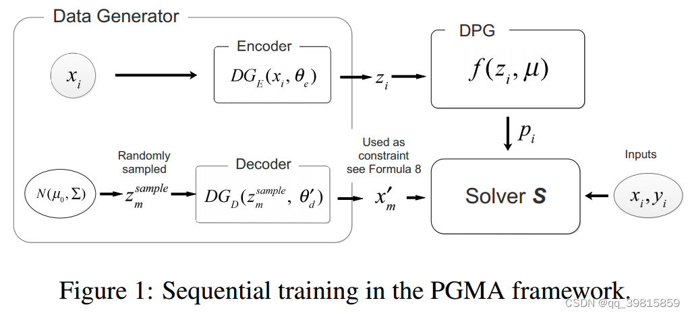
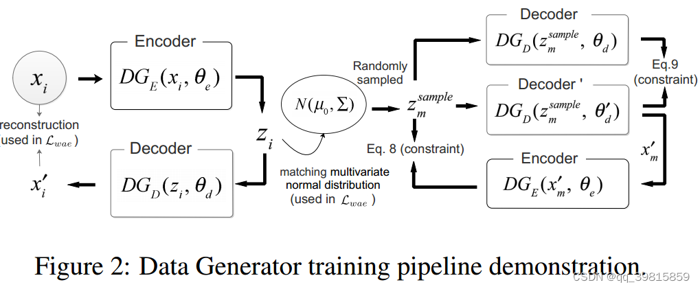
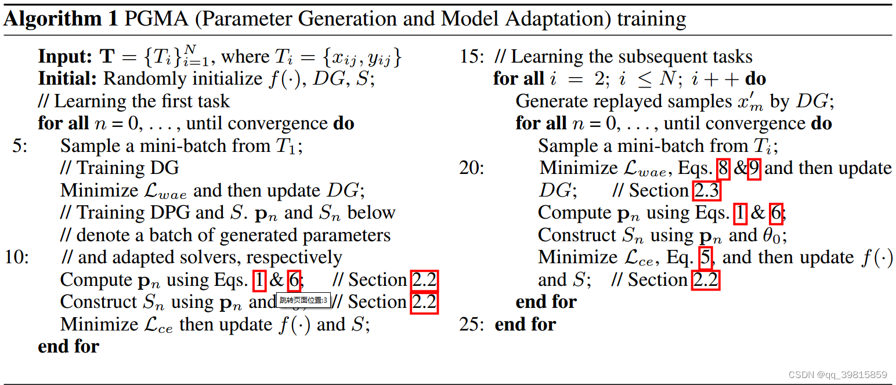

---
title: Overcoming Catastrophic Forgetting for Continual Learning via Model Adaptation
summary: ICLR2019 | Model adapt, task-specific parameter space.
date: 2024-06-10
authors:
  - admin
tags:
  - Adaptation
  - continual learning
---
>[原文](https://openreview.net/forum?id=ryGvcoA5YX)
## PGMA介绍
PGMA（Parameters Generation and Model Adaptation），作者提出的模型与之前的LwF、EWC、iCarL方法大不相同。PGMA不像LwF或EWC，学习一整套的参数，来应对所有的任务。它将分类器的参数分为两部分，一部分为所有任务共享参数集，另一部分为任务特定参数集。对于每一个训练（测试）实例，都为其生成特定的参数集来完成分类等任务。
### PGMA由三部分组成：
- Solver 
主要的分类模型。有两套参数，分别是对所有任务共享的参数集$\theta_0$，以及任务特定的参数集$H$。$H$由DPG针对特定的训练（测试）样本动态生成。
- Data Generator（DG）
DG有两个作用，主要的作用是来生成过去任务的数据，来抗遗忘。次要作用是来生成嵌入向量$z_i$。
所以DG由两部分组成：Decoder和Encoder，分别用来生成过去的数据和生成嵌入向量。

- Dynamic Parameter Generator（DPG）
接受训练样本$x_i$，和一个嵌入向量$z_i$，由DG生成。DPG利用$z_i$来产生针对$x_i$的参数集，替换Solver中的$H$。
	> 使用$z_i$而不是用原始数据$x_i$的原因是原始数据的维度可能过高，计算处理起来十分麻烦，所以采用embedding的方式来降低计算复杂度，降低映射空间。 

### Symbol denotation
$x_i$是真实数据集中的数据，$y_i$是$x_i$对应的标签；$z_i$表示嵌入向量；$p_i$表示DPG生成的参数，传递给Solver。
从上图可以看出，DG由两部分组成，分别是$DG_E$和$DG_D$，代表Encoder和Decoder。其中$\theta_e$表示Encoder网络中的参数，$\theta_d$表示Decoder网络中的参数。
$\mu$代表DGP网络中已经训练好的参数，$x_m^{'}$表示生成的过去任务的数据（replayed data）。

## Loss function
模型训练的目标是最小化目标函数，继而使模型能够得出理想的结果。PGMA由多个部分组成，所以每个部分都有其相应的Loss function。
对于DPG & S：
$$\begin{aligned}
\underset{\mu, \theta_{0}}{\operatorname{minimize}} & \mathcal{L}_{c e}\left(S\left(x_{i}, \theta_{i}^{*}\right), y_{i}\right) \\
\text { s.t. } & \sum_{m=1}^{M}\left\|\mathcal{R}\left(x_{m}^{\prime}, \theta_{i}^{*}\right)-\mathcal{R}\left(x_{m}^{\prime}, \theta_{i-1}^{*}\right)\right\|<\epsilon_{r}
\end{aligned}$$
$\mathcal{L}_{ce}$是交叉熵损失函数，要求$\mu$和$\theta_0$使得$\mathcal{L}_{ce}$最小，但同时要满足第二个式子的条件。

对于DG，先来看一下DG的训练流程：

在上图的左半部分，$x_i$经由encode得到$z_i$，然后$z_i$经过decoder之后得到$x_i^{'}$，即重放数据。与原数据$x_i$作比较，计算损失，来提高重放的精度。
右半部分，有两个constraint，还有两个decoder。这两个decoder的不同之处在于其参数不同，一个是$\theta_d$，一个是$\theta_d^{'}$。$\theta_d^{'}$的意思是decoder在对优化（训练）当前任务$T_i$之前的参数集。
我们可以看到，随机取样的向量z，由两个decoder接收，生成两个重放数据，然后要这两个重放数据的差异最小化，防止遗忘过去的知识（Eq9）；同时，将decoder ‘ 产生的重放数据$x_m^{'}$输入进encoder中，解码为向量$z$，与$z_m^{sample}$比较，保证取样的稳定性。（Eq8）
$$\begin{array}{l}
Eq.8:\min \sum_{m=1}^{M}\left\|\mathbf{z}_{m}^{\text {sample }}-D G_{E}\left(x_{m}^{\prime}, \theta_{e}\right)\right\| \\ \\
Eq.9:\min \sum_{m=1}^{M}\left\|D G_{D}\left(\mathbf{z}_{m}^{\text {sample }}, \theta_{d}\right)-x_{m}^{\prime}\right\|
\end{array}$$

## PGMA完整训练流程

左半部分是对于第一个任务学习时，因为一开始没有先前的学习经验，所以对于第一个任务需要单独处理。
右半部分是对剩余的任务的学习，可以看出两部分的步骤有较大的重叠。

对于实验部分，作者使用MNIST数据集和CIFAR-10数据集用来做图像分类任务。类别不多，训练过程较为容易。不再赘述。
