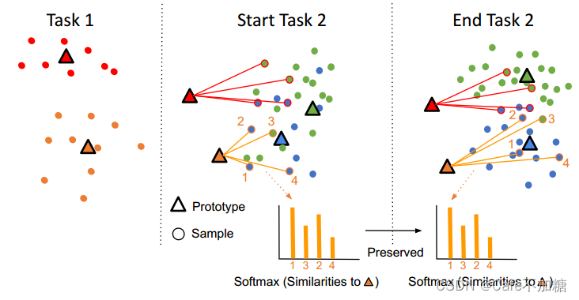

---
title: Prototype-Sample Relation Distillation Towards Replay-Free Continual Learning
summary: ICML2023 | It propose a new method for continual learning, by controling the distance between prototypes, easing forgetting in the network.
date: 2024-06-10
authors:
  - admin
tags:
  - prototype
  - continual learning
---
>[原论文](https://arxiv.org/abs/2303.14771)
## INNOVATION POINTS
本篇论文的重大创新点就是利用了prototype来控制样本之间的距离差距，尽量保持相对位置不变，以缓解Network中的遗忘。相对于目前在持续学习领域中处于主导地位的Replay方法，该方法不存储之前学习过的数据，也就不进行数据重放来巩固之前的知识，而是利用关系蒸馏和监督对比学习，解决了Replay方法的存储数据和数据隐私等问题，为replay-free的持续学习领域给予启发。
## PROTOTYPE 原型
作者在文中所提到的prototype 是指一个线性层（作者代码中体现）。对于N个类，作者设置了N个prototypes，每个prototype由一个线性层构成，prototype接受一个sample作为输入，得到该sample的线性输出向量，称之为score，在之后的Objective function中作条件和constraints。

## OBJECTIVE LOSS FUNCTION
模型的损失函数由三部分构成，来优化模型网络结构和prototypes，缓解遗忘。
### Supervised Contrastive Learning
作者利用SC的思想，弃用cross entropy ，使用supervised contrastive loss 作为目标函数来进行优化。
$$L_{SC}(X) = - \sum_{x_i\in X } \frac{1}{|A(i)|}L_{SC}(x_i)$$
对于每个类的样本的loss function：
$$L_{SC}(x_i) = \sum_{X_p \in A(i)}\log \frac{h\left(g \circ f\left(\mathbf{x}_{p}\right), g \circ f\left(\mathbf{x}_{i}\right)\right)}{\sum_{\mathbf{x}_{a} \in \mathbf{X} / x_{i}} h\left(g \circ f\left(\mathbf{x}_{a}\right), g \circ f\left(\mathbf{x}_{i}\right)\right)}$$
$h(a,b) = \exp(sim(a,b)/t)$	,sim(a,b)即计算向量a，b的cos(a，b）。
### Prototype Learning without Contrasts
$$\max \space L_p = (X) = - \frac{1}{|X|} \sum_{x_i,y_i \in X,Y} sim(p_{y_i},sg[f_\theta(x_i)])$$
sg是指梯度截断操作。该函数用来计算prototype与sample的representation之间的相似度，通过最大化该函数，对prototyp进行优化。
一旦获得了prototypes，我们即可以利用sample的representation和prototypes来计算相似度，以判断哪个类与sample最相似。
### Prototypes-Samples Similarity Distillation
因为在对网络进行优化的过程中（SC loss）,对参数进行更新，所以对每个样本进行forward得到的feature就会改变，进而使得prototype变得“过时”，得到的预测结果会有很大偏差（forgetting）。
计算Prototype与当前sample的Softmax输出：
$$\mathcal{P}_{t}\left(\mathbf{p}_{k}^{t}, \mathbf{X}\right)_{i}=\frac{h\left(\mathbf{p}_{k}^{t}, f_{\theta_{t}}\left(\mathbf{x}_{i}\right)\right)}{\sum_{\mathbf{x}_{\mathbf{j}} \in \mathbf{X}} h\left(\mathbf{p}_{k}^{t}, f_{\theta_{t}}\left(\mathbf{x}_{j}\right)\right)}$$
作者利用KL Divergence来进行一个relation distillation，保持当前prototype与之前的prototype的相似度：
$$\mathcal{L}_{d}(\mathbf{P})=\sum_{\mathbf{p}_{k} \in \mathbf{P}_{o}} K L\left(\mathcal{P}_{t}(k) \| \mathcal{P}_{t-1}(k)\right)$$

最后总的loss function是：
$$\mathcal{L}(\mathbf{X}) = \mathcal{L_{sc}}(\mathbf{X})+\alpha\mathcal{L_p}(\mathcal{\mathbf{X}},P_c)+ \beta\mathcal{L_d}(\mathcal{\mathbf{X}},P_o)$$

