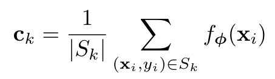
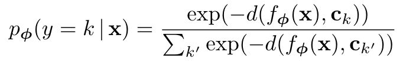

## Core idea

作者提出了一种新的分类方式，旨在利用类别的原型完成分类任务。通过计算测试数据与原型的“距离”，可以判断其属于哪一类。

Left: Few-shot prototypes ck are computed as the mean of embedded support examples for each class. Right: Zero-shot prototypes ck are produced by embedding class meta-data vk. In either case, embedded query points are classified via a softmax over distances to class prototypes: $p\varphi(y = k|x) ∝ exp(−d(f_{\phi}(x), c_k))$.

## Prototypical Network

### Prototypes

每个原型$c_k \in R^M$是其所属类别特征的均值。$S_k$是总的数据量，$f_{\phi}$是特征提取函数。

模型预测方法：

d：距离计算函数(平方差距离)
