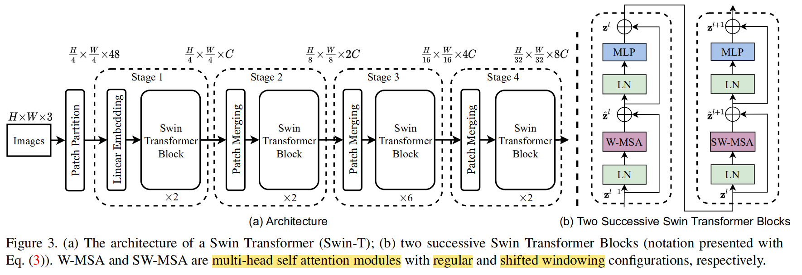
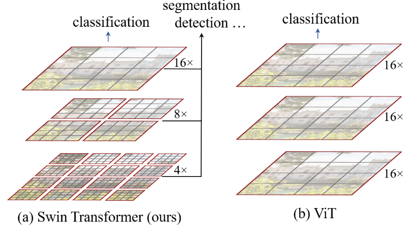
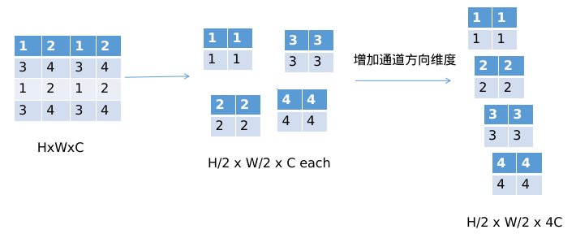
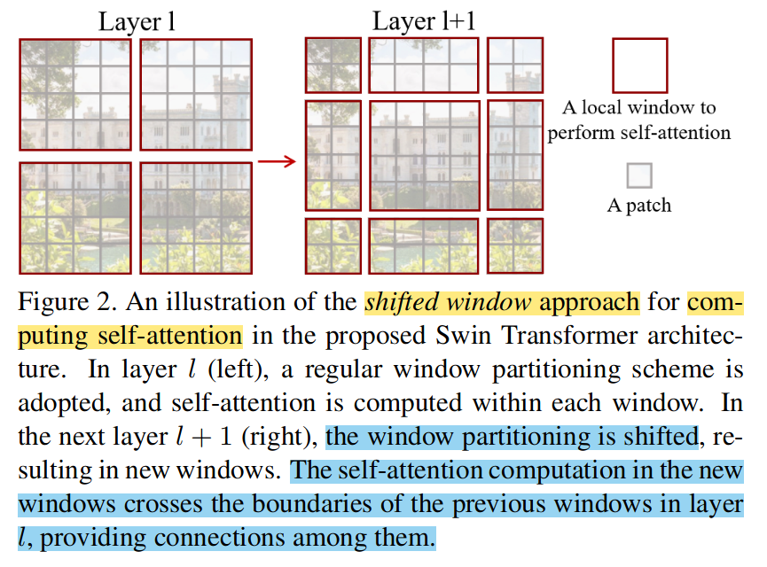
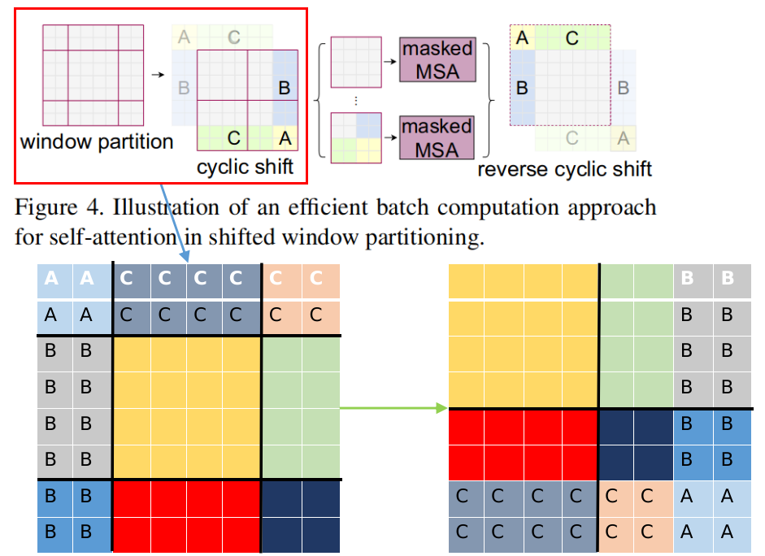
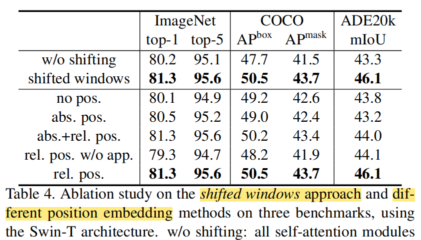

---
title: Swin Transformer
summary: ICCV 2021 best paper award.
date: 2021-10
authors:
  - admin
tags:
  - Deep learning
  - Transformer
  - Computer Vision
image:
  caption: 'Image credit: [**Unsplash**](./image.png)'

---

## Model Structure

Swin Transformer在计算注意力时分成多个层级，每个层级将样本划分为不同大小的windows，然后在每一个windows中计算自注意力。   
不同的层级windows的形状不同，所以可以使相邻层级之间的注意力计算产生联系。
### patch merging

再对得到的张量在C 这个维度上进行卷积降维，变成 **H/2 x W/2 x 2C**

## shifted window based self-attention
典型的transformer结构计算全局的自注意力，而这样的计算复杂度与token的平方成正比，这使得它不适合许多需要大量tokens进行密集预测或表示高分辨率图像的视觉问题。

全局自注意力和基于窗口的注意力计算复杂度：
$$Ω(MSA) = 4hwC2 + 2(hw)2C$$
$$Ω(W-MSA) = 4hwC2 + 2M 2hwC,$$

## Efficient batch computation for shifted configuration
滑动窗口机制带来了一个问题，他会使windows数量增加。如在上图中，在layer l时windows数量为4，layer l+1时windows数量为9.有一些window的大小可能比M还要小     

我们提出了通过*cyclic-shifted* toward left-top direciton的更有效的批计算方法

经过这样的变换后，一个window中可能包括变换前的多个不相邻的子window，所以我们采取一种mask的方式来限制跨window的自注意力计算。通过cyclic-shifted，窗口的数量与常规窗口分区的数量相同，因此也很有效。

## Relative position bias
$$Attention(Q,K,V) = \text{SoftMax}(QK^T/\sqrt{d}+B)V$$
Q,K,V是查询,键和值矩阵，d是Q和K的维度。

