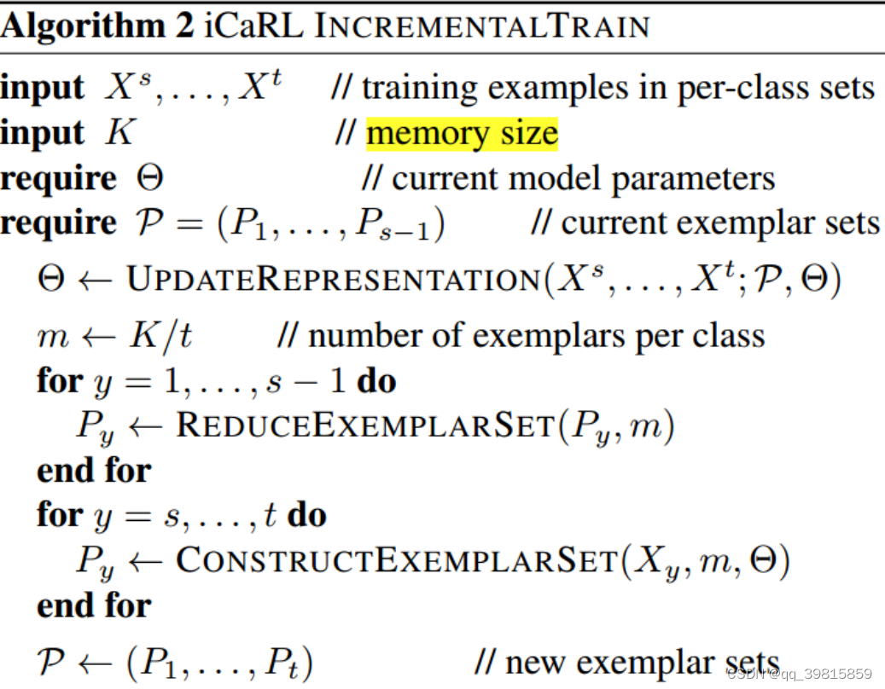
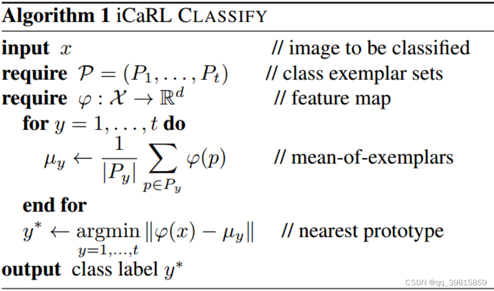
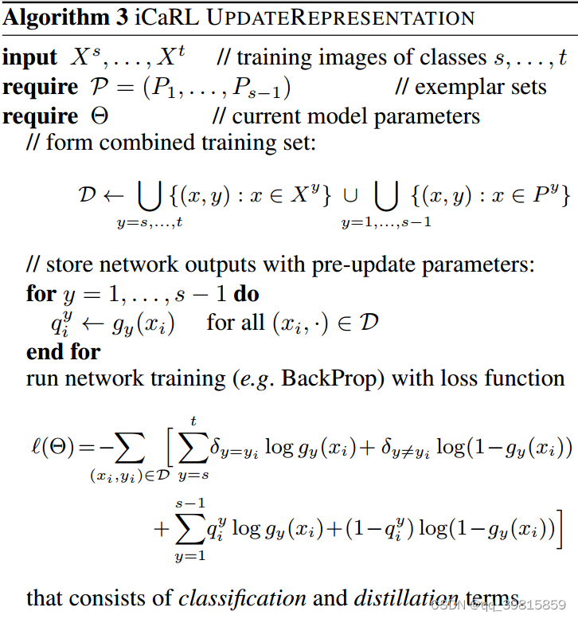
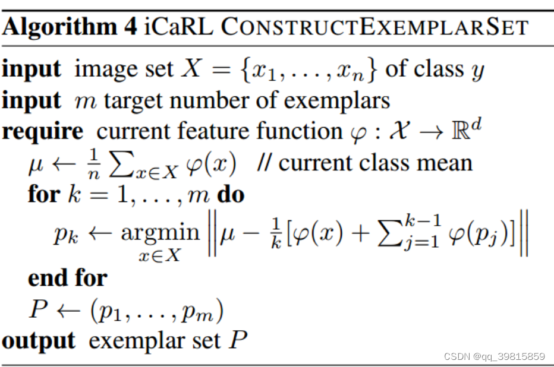
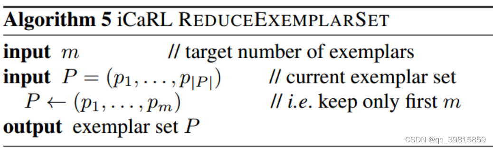

---
title: iCarL
summary: CVPR2017 | Replay data, NME, KD & Prototipical.
date: 2024-06-10
authors:
  - admin
tags:
  - Replay
  - continual learning
---
>[原文](https://arxiv.org/abs/1611.07725)
## 作者定义的类增量学习算法的三种特性

1. 它是可以在一个数据流中学习，而且数据流中的不同类别的样本可以出现在不同的时刻。
2. 它应当在任何时刻都能够提供一个卓有成效的分类器，能够对已经观察到的类进行分类。
3. 对已经“看”到的类别而言，它的计算能力和内存占用应该是有限的，至少是非常缓慢的增长。

## iCarL构成
- 基于**最近样本均值**（*nearest-mean-of-exemplars*）法的分类器
- 基于**集群**（*herding*）方法的样本优先选择
- 基于**知识蒸馏**和**原型彩排**（*prototype rehearsal*）的表征学习

## iCarL 算法

在每一次新类到达时，iCarL都要进行更新，调整网络的内部参数和样本。

- iCarL 首先利用当前的样本和数据，进行网络参数的更新
- 进而计算当前内存所能容纳的样本数量，计算样本容量
- 接下来是一个循环，对所有的类别进行样本缩减。
- 之后是另一个循环，重新构筑每个类的样本，得到新的样本集合

### 最近样本均值分类（nearest-mean-of-exemplars）

为预测一个新的图片$x$的类别$y^*$，iCarL为一观察到的每个类计算一个原型向量（*prototype vector*），$\{\mu_1,\mu_2...,\mu_t\}$，原型向量的计算公式为：$\mu_y = \frac{1}{|P_y|}\sum_{p\in P_y}\varphi(p)$，所以$\mu_y$即为类别y的所有样本的均值特征向量。

> $P_y$表示y类的样本集合，p代表某个样本。

以此原型向量来进行分类：$y^* = argmin_{y=\{1...t\}}||\varphi(x)-\mu_y||$，最小化均方误差。

在iCarL中，不能计算真正的类均值，因为这样需要存储所有的类数据，与增量学习原则相悖。

> $y^*$也可以写成$y^* = argmax_y\mu_y^\top\varphi(x)$。

### 更新表征的算法（*update representation*）

当iCarL遇到新的类别时，就要启动更新算法。

- 首先，iCarL会构建一个新的训练集合，由当前存储的样本和新的数据构成。

- 接下来，iCarL需要将它的网络参数保存，以便于进行之后的优化（*知识蒸馏*）。

- 然后利用新的训练集合来训练网络，最小化损失函数。

  对于损失函数$\ell(\Theta)$，第一个部分是计算新的类别的交叉熵，来学习分辨新的类；而第二个部分是利用知识蒸馏来巩固之前学习的知识（*network parameters*），防止遗忘。

> 作者通过对数据集进行扩充以及对loss function进行“扩充”来减缓灾难性遗忘。

### 样本集构建算法

作者对样本集的重构算法。将原样本集合缩减到m个样本。

- 首先计算数据集$X$的特征均值$\mu$

- 然后循环m次计算m个新的样本，minimize loss function。

  该function的目的是求距离$\mu$ 最近的样本特征，选择使得该function最小的$x$，作为新的样本$p_k$。

- 然后将得到的样本集合为新样本集（exemplar sets）。

### 样本集缩减算法

- 样本集缩减算法比较简单，选定常数m，直接从原样本集中选择前m个样本即可。

  因为在构建样本集的时候，算法是得到的样本集是有优先级的（*prioritized*）。

## iCarL 网络架构

iCarL采用了经典深度学习的CNN网络结构，最后加上一个单层分类层，由sigmoid函数作为激活函数，对已经发现的类别进行分类。iCarL仅仅利用网络进行表征学习，并不用于分类。

习的CNN网络结构，最后加上一个单层分类层，由sigmoid函数作为激活函数，对已经发现的类别进行分类。iCarL仅仅利用网络进行表征学习，并不用于分类。

